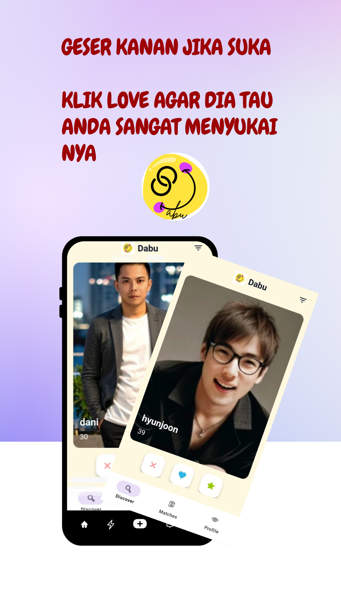
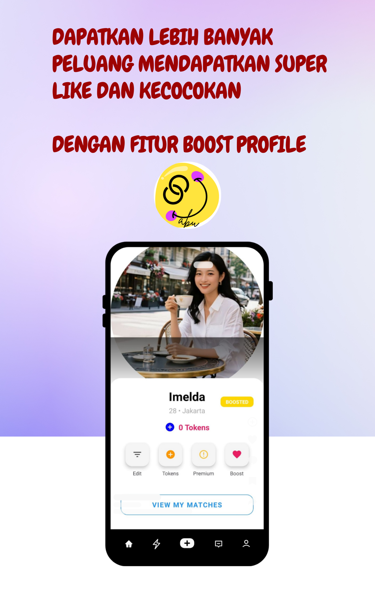
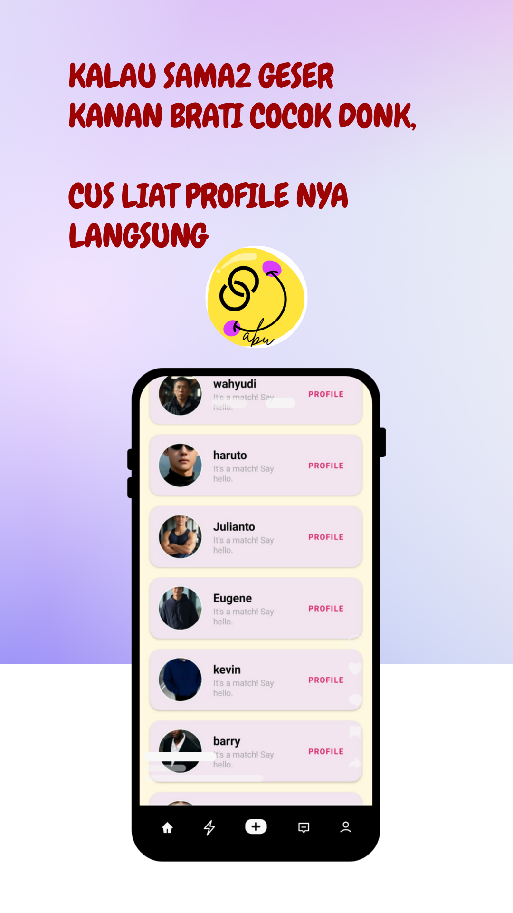
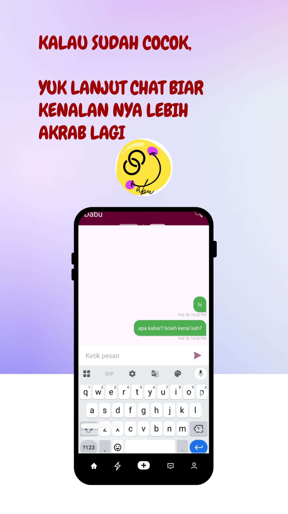

# Dabu - Modern Dating & Matchmaking App 🚀 (portfolio)

**Dabu** is a modern Android dating application designed to connect people through an intuitive matchmaking system. This project demonstrates full integration between native mobile development (Android) and a cloud-native backend (Firebase).

(Source code is Private, contact for access)
---

## 📱 Key Features

- **Intuitive Swipe Interface:** Uses a card-stack system (swipe left/right) to find matches quickly and enjoyably.
- **Real-Time Chatting:** Instant messaging feature integrated with Firebase Firestore for seamless communication after a match occurs.
- **Smart Matching Algorithm:** A system that automatically detects compatibility based on user swipe interactions.
- **Monetization System:** Full integration with **Google Play Billing Library v6+** for purchasing Tokens, Premium packages, and Booster features.
- **Advanced User Profile:** Users can upload photo galleries, set bios, locations, and manage profile preferences dynamically.
- **Safety & Security:** Equipped with **Report** and **Block** features to keep the community safe and comfortable.
- **Push Notifications:** Real-time notifications using Firebase Cloud Messaging (FCM) for match activity and new messages.

---

## 🛠️ Tech Stack & Architecture

### Frontend (Mobile)
- **Language:** Kotlin (100% Native)
- **UI Framework:** XML Layouts with Material Design 3.
- **Components:** ViewBinding, Navigation Component, CardStackView Library, Glide (Image Loading).
- **Architecture:** MVVM (Model-View-ViewModel) for clean logic and UI separation.

### Backend & Infrastructure
- **Database:** Firebase Firestore (NoSQL) for user data, messages, and matches.
- **Authentication:** Firebase Auth (Email & Google Sign-In).
- **Storage:** Firebase Cloud Storage for profile and gallery photo storage.
- **Server-Side Logic:** Firebase Cloud Functions (Node.js/TypeScript) for backend automation.
- **Monetization:** Google Play Billing Library.
- **Ads:** Google AdMob SDK for Banner and Interstitial ad integration.

---

## 📸 Screenshots & Demo

| Swipe Home | User Profile | Matches | Chat Interface  |
| :---: | :---: | :---: | :---: |
|  |  |  |   |

## 📬 Contact Me

If you are interested in discussing this project or other collaboration opportunities, please reach out via:

- **Email:** dwinurabdayanti@gmail.com
  
## 🚀 Project Status

The app is currently in the **Closed Testing** phase on the Google Play Console with **20+ active testers**. This project covers the entire app development lifecycle, from UI design and backend feature development to compliance with Google Play policies (Data Safety & Child Safety Standards).

---

---
*Created with ❤️*

    
